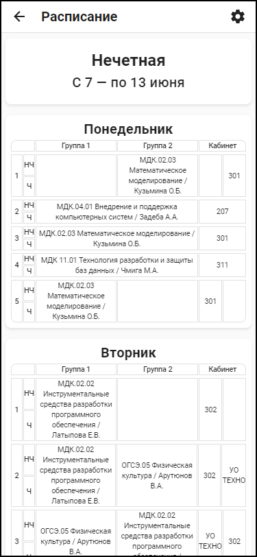

<p align="center">
    
</p>

# time-table

Электронное расписание v2.0 — Remake

## Установка

### Windows

- Скачайте nodejs https://nodejs.org/en/
- Скачайте Visual Studio Community https://visualstudio.microsoft.com/ru/ (в Visual Studio Installer выберите пункт "Разработка классических приложений на C++")
- Скачайте Python https://www.python.org/downloads/
- Установите yarn `npm install -g yarn`

### Linux

- Установить зависимости: `gcc`, `make`, `nodejs`, `npm`
- Установите yarn: `sudo npm install -g yarn`

### Сборка и запуск

```
cd time-table
yarn
yarn run build
yarn run start
```

## Настройка

Пароль для доступа к панели админа, указан в файле `.env`\
Пример файла:

```
API_TOKEN=VALD_TOKEN
```

## Документация API

| Parameter     | Type     | Description  |
| :------------ | :------- | :----------- |
| `subDivision` | `String` | Имя площадки |
| `groupName`   | `String` | Имя группы   |
| `teacherName` | `String` | Имя учителя  |

### Получение имен групп и учителей

```
GET /api/[subDivision]/groups?onlyNames=true
[
    "GROUP_111",
    "GROUP_151d",
    "GROUP_111d",
    "GROUP_131",
    "GROUP_121",
    ...
]
```

```
GET /api/[subDivision]/teachers?onlyNames=true
[
    "TeacherFullName 1",
    "TeacherFullName 2",
    "TeacherFullName 3",
    "TeacherFullName 4",
    "TeacherFullName 5",
    ...
]
```

---

### Получение расписание для всех групп или учителей

```
GET /api/[subDivision]/groups
{
    "GROUP_411": {
        "timeTable": {},
        "replacements": {},
        "lastUpdatedAt": ""
    }
}
```

```
GET /api/[subDivision]/teachers
{
    "TeacherFullName 1": {
        "timeTable": {},
        "replacements": {},
        "lastUpdatedAt": ""
    }
}
```

---

### Получение расписание для конкретной группы или учителя

```
GET /api/[subDivision]/groups/[groupName]
{
    {
        "timeTable": {},
        "replacements": {},
        "callTimes": [
            { "start": "", "end": "" },
            { "start": "", "end": "" },
            [
                { "start": "", "end": "" },
                { "start": "", "end": "" },
            ],
            { "start": "", "end": "" },
            { "start": "", "end": "" },
        ],
        "lunchTimes": {
            "start": "",
            "end": ""
        },
        "lastUpdatedAt": ""
    }
}
```

```
GET /api/[subDivision]/teachers/[teacherName]
{
    "TeacherFullName 1": {
        "timeTable": {},
        "replacements": {},
        "lastUpdatedAt": ""
    }
}
```

## Конструктор и панель админа

Путь до панели админа: `/admin`. Пароль указан в файле `.env`

Путь до конструктор: `/[subDivision]/editor`. Пароль можно узнать в панели админа (еще можно использовать пароль админа для доступа к конструктору от любой площадки).

## Скриншоты

<h3>Выбор площадки и режима расписания</h3>
<p align="center">
  
   
  
</p>

<h3>Настройки и просмотр</h3>
<p align="center">
  
  
  
</p>

<h3>Темная тема</h3>
<p align="center">
 
 
 
</p>

<h3>Демонстрация</h3>

